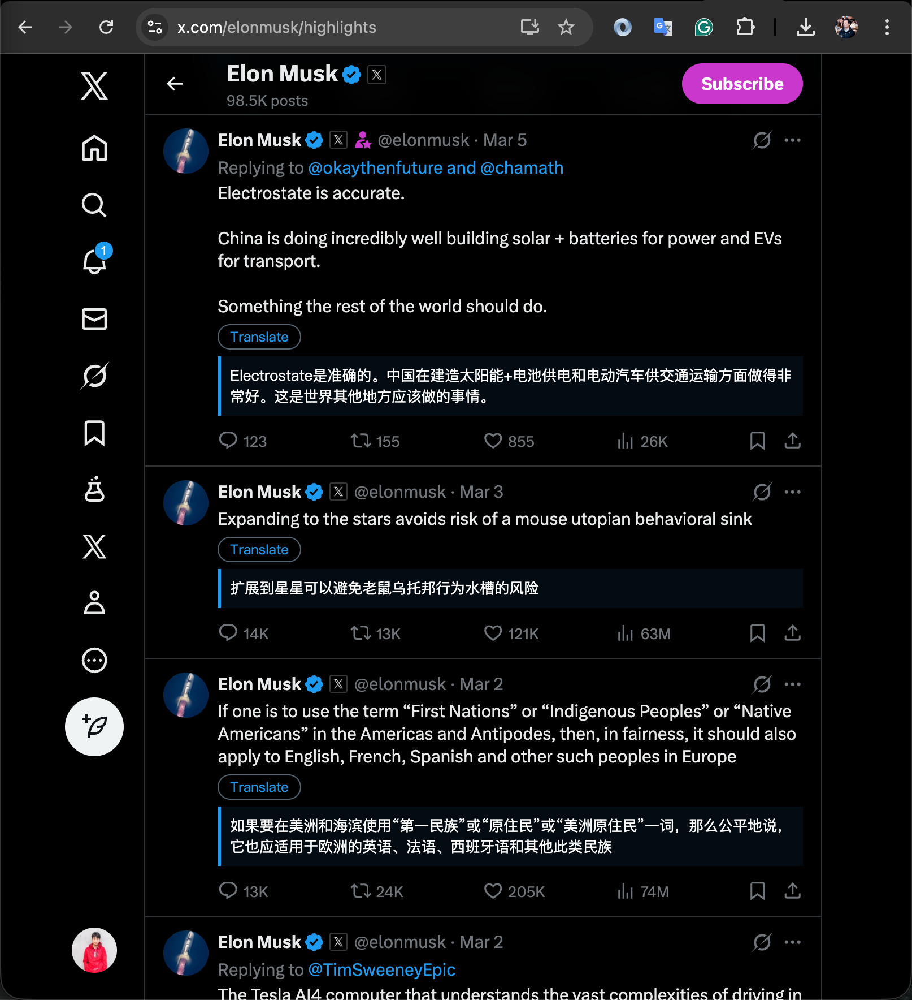

# X Tweet Translator

一个用于在 X（Twitter）时间线上翻译推文的 Chrome 插件 MVP。

> 本项目为 AI Coding 实践项目，基于 OpenAI Codex（GPT-5.3-Codex）完成开发与迭代。

## 图片预览

## 当前功能

- 自动识别页面中的推文正文（`data-testid="tweetText"`）
- 自动识别并翻译推文内文章卡片标题（非中文）
- 支持自动翻译可见推文
- 支持手动点击 `Translate` 翻译单条推文
- 翻译结果本地缓存（7 天过期），减少重复请求
- 翻译请求节流（最小 800ms 间隔），降低接口抖动
- 限流保护（429 自动退避重试 + 短时冷却）
- 多翻译源自动切换（主服务限额/限流后自动降级到后备服务）
- 翻译按钮显示当前 Provider（如 `MyMemory / Google GTX / LibreTranslate`）
- 自动隐藏带有 `Ad` 标识的广告推文
- Popup 中可配置：
  - 插件开关
  - 自动翻译开关
  - 目标语言

## 技术方案（MVP）

- `content script` 注入到 `x.com` 页面，负责识别推文并渲染翻译 UI
- `service worker` 统一发起翻译请求（当前接 MyMemory 免费接口）
- 翻译服务采用多 Provider 自动降级（MyMemory -> Google GTX -> LibreTranslate）
- 后台会自动做基础语言识别（zh/ja/ko/ru/en）后再调用接口，避免 `AUTO` 参数报错
- 后台包含请求去重、请求节流、翻译缓存逻辑
- `chrome.storage.sync` 保存用户设置
- `chrome.storage.local` 保存翻译缓存

## 本地运行

1. 打开 Chrome，进入 `chrome://extensions`
2. 打开右上角 `开发者模式`
3. 点击 `加载已解压的扩展程序`
4. 选择本项目目录
5. 打开 `https://x.com` 验证效果

## Changelog

> 规则：每次 `manifest.json` 版本号变更时，必须同步更新本节。

### v0.1.13
- 修复卡片标题译文不显示问题（容器定位改为 ID 绑定）
- 统一支持“相邻插入”和“卡片外部插入”两种译文渲染路径

### v0.1.12
- 修复卡片标题译文显示位置：从卡片覆盖层改为卡片外部下方展示
- 避免译文压住图片/标题导致可读性问题

### v0.1.11
- 调整卡片文章标题翻译交互：不再显示翻译按钮，仅展示译文
- 推文正文保留按钮交互，卡片标题采用自动翻译输出

### v0.1.10
- 新增推文内文章卡片标题翻译（非中文标题自动注入翻译入口）
- 抽象通用节点绑定逻辑，统一处理推文正文与卡片标题

### v0.1.9
- 翻译按钮增加 Provider 标识（明确展示由哪家翻译服务提供）
- 缓存记录新增 provider 字段，缓存命中时也能显示来源

### v0.1.8
- 新增 Google GTX 后备翻译源，降低 `429 + 400` 组合失败概率
- 优化后备接口错误处理（LibreTranslate 的 `HTTP 400` 返回细化）

### v0.1.7
- 新增多翻译源自动切换（主服务不可用时自动切换后备服务）
- Provider 级限流冷却（单一服务 429 不会阻塞全部翻译）
- 新增 LibreTranslate 后备接口支持

### v0.1.6
- 新增 429 限流处理：自动退避重试
- 新增限流冷却窗口，避免连续请求导致反复报错
- 优化限流提示文案（包含建议重试等待时间）

### v0.1.5
- 新增翻译缓存（`chrome.storage.local`，7 天 TTL）
- 新增请求去重与节流（最小 800ms 间隔）
- 新增合规文档：`PRIVACY.md`、`STORE_LISTING.md`

### v0.1.4
- 新增插件 Logo 与多尺寸图标（16/32/48/128）
- Popup 顶部展示品牌图标
- 统一项目名为 `X Tweet Translator`

### v0.1.3
- 中文推文默认跳过，不注入翻译入口
- 后台增加中文兜底（中文不发翻译请求）

### v0.1.2
- 新增广告推文隐藏（识别 `Ad/广告` 标签）

### v0.1.1
- 修复 MyMemory `AUTO` 源语言报错
- 增加源语言规范化与基础识别逻辑

### v0.1.0
- 初始化 Chrome MV3 插件 MVP
- 支持推文识别、手动/自动翻译、Popup 设置

## 注意事项

- 这是 MVP，MyMemory 免费接口有配额和稳定性限制。
- 后续建议替换为可控翻译服务（如 DeepL / OpenAI / 自建服务）。
- X 页面 DOM 可能变化，选择器需要持续维护。

## 合规与上架文档

- 隐私政策草案：[PRIVACY.md](./PRIVACY.md)
- Chrome Web Store 上架文案草案：[STORE_LISTING.md](./STORE_LISTING.md)
